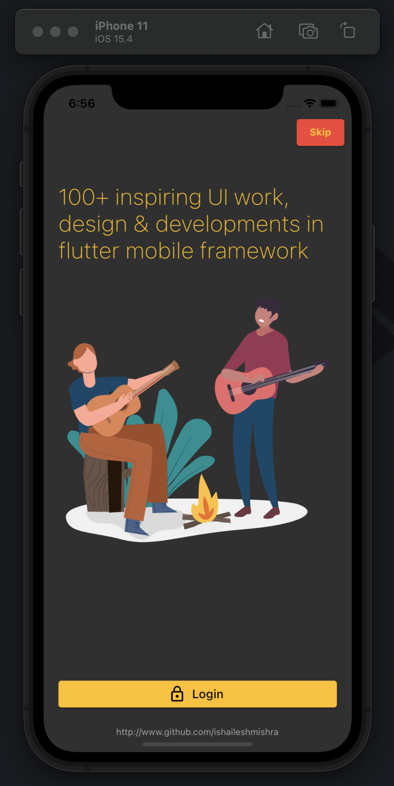
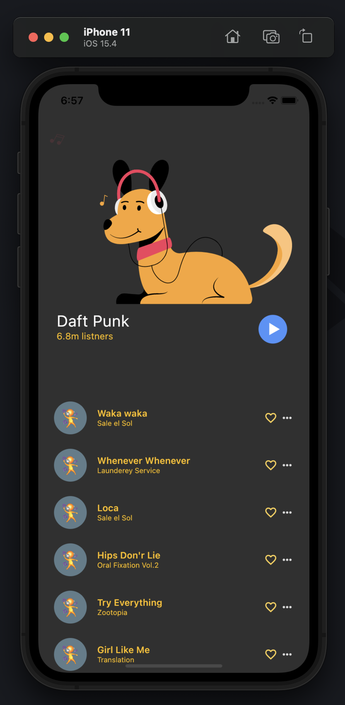
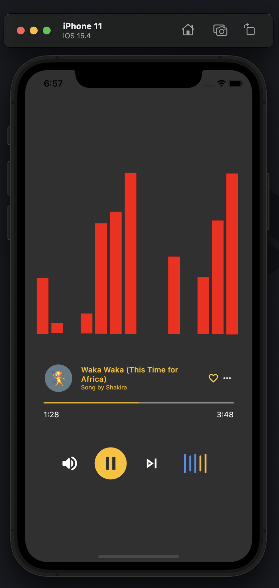

# ᗰᑌSIᑕ ᑌI ᖴᒪᑌTTEᖇ ᗩᑭᑭ

### 𝙻𝚎𝚝𝚜 𝚌𝚛𝚎𝚊𝚝𝚎 𝚊 𝚄𝙸 𝚏𝚘𝚛 𝚝𝚑𝚎 𝚖𝚞𝚜𝚒𝚌 𝚊𝚙𝚙𝚕𝚒𝚌𝚊𝚝𝚒𝚘𝚗 : 𝟹 𝚑𝚘𝚞𝚛 𝚌𝚑𝚊𝚕𝚕𝚊𝚗𝚐𝚎

A new Music Flutter Application Project.

## Getting Started

Step 1: Recreate iOS, android & windows folders by running below command

    flutter create .

Step 2: Run below command to start app

    flutter run

### Screenshots

#### Watch

  

- [Lab: Write your first Flutter app](https://flutter.dev/docs/get-started/codelab)
- [Cookbook: Useful Flutter samples](https://flutter.dev/docs/cookbook)

For help getting started with Flutter, view our
[online documentation](https://flutter.dev/docs), which offers tutorials,
samples, guidance on mobile development, and a full API reference.
